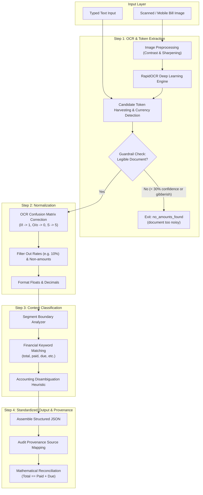

# 🩺 MediExtract AI
### Intelligent Financial Amount Extractor & Auditor for Medical Documents

[](https://www.python.org/downloads/)
[](https://fastapi.tiangolo.com)
[](https://docs.pydantic.dev)
[](https://github.com/RapidAI/RapidOCR)
[]()
[](https://opensource.org/licenses/MIT)

**MediExtract AI** is a production-ready backend service designed to parse and audit complex financial data from medical bills, pharmacy receipts, and hospital invoices. It handles messy real-world documents—including crumpled receipts, mobile snapshots, and corrupted OCR character substitutions—converting them into structured, verified financial records with audit trails.

---

## 🌟 Key Highlights

- **Robust 4-Stage Extraction Pipeline**:
  - **Step 1 - OCR & Token Extraction**: Deep learning OCR powered by `RapidOCR` (ONNX runtime) combined with Pillow image contrast/sharpness enhancements to extract text from degraded receipts.
  - **Step 2 - OCR Digit Correction & Normalization**: Custom confusion matrix repairing OCR misreads (`l200` $\rightarrow$ `1200`, `25O` $\rightarrow$ `250`, `I500` $\rightarrow$ `1500`) while discarding discount percentages and non-monetary integers.
  - **Step 3 - Context Classification**: Context-window analysis mapping numbers into financial roles (`total_bill`, `paid`, `due`, `discount`, `tax`).
  - **Step 4 - Structured Output & Audit Provenance**: Clean JSON output linking every extracted number directly to its original text snippet (`source: "text: 'Total: INR 1200'"`).
- **Enterprise Guardrails**:
  - **Readability & Noise Filter**: Automatically detects degraded or illegible documents and exits safely with `{"status":"no_amounts_found","reason":"document too noisy"}`.
  - **Mathematical Reconciliation**: Built-in verification check ensuring accounting balance (`Total == Paid + Due`) and flagging discrepancies.
- **Dual AI & Hybrid Architecture**:
  - **Offline-First Deterministic Engine**: 100% functional out of the box with zero external API key requirements.
  - **LLM Chaining**: Supports optional Gemini multimodal integration (`GEMINI_API_KEY`) for advanced semantic disambiguation and anti-hallucination validation.
- **Interactive Visual Demo UI**: Embedded single-page web interface for testing sample bills, uploading images, and visualizing pipeline stages live.

---

## 🏛️ System Architecture



---

## 📂 Project Structure

```
├── app/
│   ├── main.py                  # FastAPI server entrypoint, CORS & static UI mounting
│   ├── config.py                # Environment configuration (.env support)
│   ├── schemas.py               # Pydantic V2 models for requests, responses & guardrails
│   ├── api/
│   │   └── routes.py            # API routes: /process, /pipeline, /step1-4
│   ├── services/
│   │   ├── ocr_service.py       # RapidOCR engine, preprocessing & token extraction
│   │   ├── normalizer.py        # OCR character-to-digit confusion matrix repair
│   │   ├── context_classifier.py # Sliding-window provenance & context labeling
│   │   ├── ai_extractor.py      # Optional Gemini AI chaining & semantic extraction
│   │   ├── guardrails.py        # Noisy document & math balance verification
│   │   └── pipeline.py          # Unified 4-stage pipeline orchestrator
│   └── static/                  # Interactive Demo UI (HTML/CSS/JS)
│       ├── index.html
│       ├── style.css
│       └── app.js
├── tests/
│   ├── test_pipeline.py         # Unit tests for all 4 steps, OCR errors & noise
│   └── test_api.py              # Integration tests for FastAPI endpoints
├── samples/
│   ├── generate_sample_images.py # Script generating sample bill images
│   ├── sample_bills.json        # Test cases and expected outputs
│   ├── sample_receipt_standard.png
│   ├── sample_receipt_noisy.png
│   └── sample_receipt_unreadable.png
├── postman/
│   ├── MediExtract_Amount_Detection.postman_collection.json
│   └── curl_examples.sh
├── requirements.txt             # Locked Python dependencies
├── run.py                       # One-click server launcher
├── pytest.ini                   # Pytest configuration
└── README.md
```

---

## 🚀 Quickstart Guide

### 1. Prerequisites
- Python 3.10+ (tested on Python 3.14)
- Git

### 2. Setup Virtual Environment & Install Dependencies
```bash
# Clone the repository
git clone https://github.com/RohithReddyMarri/Plum-Task4-Medical-Amount-Detection.git
cd Plum-Task4-Medical-Amount-Detection

# Create virtual environment
python -m venv venv

# Activate virtual environment
# On Windows:
.\venv\Scripts\Activate.ps1
# On Linux / macOS:
source venv/bin/activate

# Install dependencies
pip install -r requirements.txt
```

### 3. (Optional) Configure Environment
```bash
cp .env.example .env
```
*Note: If `GEMINI_API_KEY` is not provided, the service operates seamlessly using the built-in local OCR and heuristic NLP engine.*

### 4. Run the Application
```bash
python run.py
```
Or directly with Uvicorn:
```bash
uvicorn app.main:app --host 0.0.0.0 --port 8000 --reload
```

Once running:
- **Interactive Web Demo**: [http://localhost:8000/](http://localhost:8000/)
- **Swagger API Documentation**: [http://localhost:8000/docs](http://localhost:8000/docs)
- **ReDoc Documentation**: [http://localhost:8000/redoc](http://localhost:8000/redoc)

---

## 🧪 Automated Testing

Run the full test suite with `pytest`:
```bash
pytest -v
```

All 13 test cases verify:
- Raw token extraction and currency inference from typed text.
- Character-level OCR digit error repair (`l200` $\rightarrow$ `1200`, `25O` $\rightarrow$ `250`).
- Discarding discount percentages (`10%`) during normalization.
- Context classification into `total_bill`, `paid`, `due`.
- Exact audit provenance strings (`source: "text: '...'"`).
- Mathematical reconciliation guardrails (`Total == Paid + Due`).
- Guardrail triggering for unreadable / degraded noisy documents.
- Multipart file upload handling and OCR image processing.

---

## 📡 API Usage & Examples

### 1. Standard Bill Request (Step 4 Schema)
```bash
curl -X POST "http://localhost:8000/api/process" \
     -H "Content-Type: application/json" \
     -d '{"text": "Total: INR 1200 | Paid: 1000 | Due: 200 | Discount: 10%"}'
```
**Response:**
```json
{
  "currency": "INR",
  "amounts": [
    {
      "type": "total_bill",
      "value": 1200,
      "source": "text: 'Total: INR 1200'"
    },
    {
      "type": "paid",
      "value": 1000,
      "source": "text: 'Paid: 1000'"
    },
    {
      "type": "due",
      "value": 200,
      "source": "text: 'Due: 200'"
    }
  ],
  "status": "ok",
  "mathematical_reconciliation": {
    "total_bill": 1200.0,
    "paid_plus_due": 1200.0,
    "is_balanced": true,
    "discrepancy": 0.0,
    "status": "Verified (Total == Paid + Due)"
  }
}
```

---

### 2. Noisy OCR Sample (Digit Confusion: `l200` $\rightarrow$ `1200`)
```bash
curl -X POST "http://localhost:8000/api/process" \
     -H "Content-Type: application/json" \
     -d '{"text": "T0tal: Rs l200 | Pald: 1000 | Due: 200"}'
```
**Response:**
```json
{
  "currency": "INR",
  "amounts": [
    {
      "type": "total_bill",
      "value": 1200,
      "source": "text: 'T0tal: Rs l200'"
    },
    {
      "type": "paid",
      "value": 1000,
      "source": "text: 'Pald: 1000'"
    },
    {
      "type": "due",
      "value": 200,
      "source": "text: 'Due: 200'"
    }
  ],
  "status": "ok"
}
```

---

### 3. Image Upload via Multipart Form
```bash
curl -X POST "http://localhost:8000/api/process" \
     -F "file=@samples/sample_receipt_standard.png"
```

---

### 4. Guardrail Trigger (Unreadable Document)
```bash
curl -X POST "http://localhost:8000/api/process" \
     -H "Content-Type: application/json" \
     -d '{"text": "--- blurred smudge !!! @#$$%^ unreadable"}'
```
**Response:**
```json
{
  "status": "no_amounts_found",
  "reason": "document too noisy"
}
```

---

### 5. Full Pipeline Trace
```bash
curl -X POST "http://localhost:8000/api/pipeline" \
     -H "Content-Type: application/json" \
     -d '{"text": "T0tal: Rs l200 | Pald: 1000 | Due: 200"}'
```
Returns a comprehensive breakdown of all intermediate steps (`step1_ocr`, `step2_normalization`, `step3_classification`, `step4_final`).

---

## 📄 License
This project is open-source and available under the [MIT License](LICENSE).
