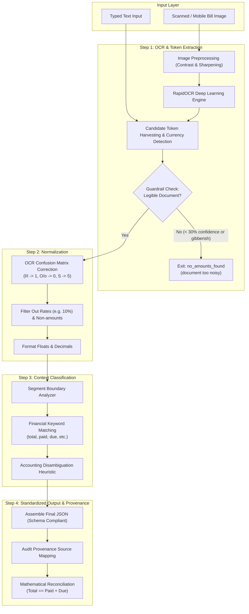

# Plum SDE Intern Assignment
## Problem Statement 4: AI-Powered Amount Detection in Medical Documents

An enterprise-grade backend service that ingests medical bills and receipts (typed text or noisy scanned images), extracts financial figures, corrects OCR character-to-digit errors, classifies amounts by semantic context, provides audit provenance, and enforces safety guardrails.

---

## 🌟 Key Highlights & Engineering Features

- **End-to-End 4-Step Pipeline**:
  - **Step 1 - OCR / Text Extraction**: High-performance ONNX-based deep learning OCR (`RapidOCR`) combined with Pillow contrast and sharpness enhancements to handle crumpled, folded, or degraded medical receipts.
  - **Step 2 - Numeric Normalization**: Specialized character-level confusion matrix repairing OCR digit artifacts (`l200` $\rightarrow$ `1200`, `25O` $\rightarrow$ `250`, `I500` $\rightarrow$ `1500`) while filtering out rates (`10%`) and non-monetary tokens.
  - **Step 3 - Context Classification**: Context-window analysis mapping numbers into financial roles (`total_bill`, `paid`, `due`, `discount`, `tax`).
  - **Step 4 - Standardized Output & Audit Provenance**: Structured JSON adhering 100% to the assignment specification, with exact textual provenance (`source: "text: 'Total: INR 1200'"`) for insurance claim auditability.
- **Enterprise Guardrails**:
  - **Document Readability Check**: Returns `{"status":"no_amounts_found","reason":"document too noisy"}` when input is illegible or degraded.
  - **Mathematical Reconciliation**: Validates financial balance (`Total == Paid + Due`) and alerts on discrepancies.
- **Dual AI & Hybrid Execution Engine**:
  - **Offline-First Deterministic Engine**: 100% functional out of the box with zero external API key requirements.
  - **Gemini LLM Chaining**: Supports optional `GEMINI_API_KEY` for advanced semantic disambiguation and anti-hallucination verification.
- **Interactive Visual Demo UI**: Embedded single-page web interface for testing sample bills, uploading images, and recording the demo walkthrough.

---

## 🏛️ Pipeline Architecture



---

## 📂 Project Structure

```
Plum_Assignment/
├── app/
│   ├── __init__.py
│   ├── main.py                  # FastAPI app entrypoint, CORS & static mounting
│   ├── config.py                # Environment configuration (.env support)
│   ├── schemas.py               # Pydantic V2 models for all 4 steps & guardrails
│   ├── api/
│   │   ├── __init__.py
│   │   └── routes.py            # API routes: /process, /pipeline, /step1-4
│   ├── services/
│   │   ├── __init__.py
│   │   ├── ocr_service.py       # RapidOCR engine, preprocessing & raw token extraction
│   │   ├── normalizer.py        # OCR character-to-digit confusion matrix repair
│   │   ├── context_classifier.py # Sliding-window provenance & context labeling
│   │   ├── ai_extractor.py      # Optional Gemini AI chaining & semantic extraction
│   │   ├── guardrails.py        # Noisy document & math balance verification
│   │   └── pipeline.py          # Unified 4-stage pipeline orchestrator
│   └── static/                  # Interactive Demo UI (HTML/CSS/JS)
│       ├── index.html
│       ├── style.css
│       └── app.js
├── tests/
│   ├── test_pipeline.py         # Unit tests for all 4 steps, OCR errors & noise
│   └── test_api.py              # Integration tests for FastAPI endpoints
├── samples/
│   ├── generate_sample_images.py # Script generating sample bill images
│   ├── sample_bills.json        # Test cases and expected outputs
│   ├── sample_receipt_standard.png
│   ├── sample_receipt_noisy.png
│   └── sample_receipt_unreadable.png
├── postman/
│   ├── Plum_Medical_Amount_Detection.postman_collection.json
│   └── curl_examples.sh
├── requirements.txt             # Locked Python dependencies
├── run.py                       # One-click server launcher
├── pytest.ini                   # Pytest configuration
└── README.md
```

---

## 🚀 Setup & Installation Instructions

### Prerequisites
- Python 3.10 to 3.14
- Git (optional, for version control)

### 1. Clone & Navigate
```bash
git clone <repository-url>
cd Plum_Assignment
```

### 2. Create and Activate Virtual Environment
**On Windows (PowerShell):**
```powershell
python -m venv venv
.\venv\Scripts\Activate.ps1
```

**On Linux / macOS:**
```bash
python3 -m venv venv
source venv/bin/activate
```

### 3. Install Dependencies
```bash
pip install -r requirements.txt
```

### 4. (Optional) Configure Environment Variables
Copy `.env.example` to `.env`:
```bash
cp .env.example .env
```
*Note: If `GEMINI_API_KEY` is not provided, the system runs seamlessly using the built-in deep-learning OCR and heuristic engine.*

---

## 💻 Running the Application

### Start the Backend Server:
```bash
python run.py
```
Or with Uvicorn directly:
```bash
uvicorn app.main:app --host 0.0.0.0 --port 8000 --reload
```

Once running:
- **Interactive Web Demo**: [http://localhost:8000/](http://localhost:8000/)
- **Swagger Interactive API Documentation**: [http://localhost:8000/docs](http://localhost:8000/docs)
- **ReDoc API Documentation**: [http://localhost:8000/redoc](http://localhost:8000/redoc)

---

## 🌐 Exposing via ngrok (Public Demo)

As requested in the submission guidelines, to provide a live public link:
```bash
# In a separate terminal
ngrok http 8000
```
This gives a public URL (e.g., `https://xxxx.ngrok-free.app`) accessible from anywhere.

---

## 🧪 Running the Automated Test Suite

Run the full suite of unit and integration tests:
```bash
pytest -v
```

All 13 test cases verify:
1. Extraction of raw tokens and currency hints from typed text.
2. Character-level OCR digit error repair (`l200` $\rightarrow$ `1200`, `25O` $\rightarrow$ `250`).
3. Discarding rates/percentages (`10%`) during normalization.
4. Surrounding context extraction and classification into `total_bill`, `paid`, `due`.
5. Audit provenance string matching (`source: "text: '...'"`).
6. Mathematical reconciliation guardrails (`Total == Paid + Due`).
7. Guardrail triggering for unreadable / degraded noisy documents.
8. File upload handling and image OCR processing.

---

## 📡 API Usage & Sample Requests

### 1. Standard Bill Request (Step 4 Schema)
```bash
curl -X POST "http://localhost:8000/api/process" \
     -H "Content-Type: application/json" \
     -d '{"text": "Total: INR 1200 | Paid: 1000 | Due: 200 | Discount: 10%"}'
```
**Expected Response:**
```json
{
  "currency": "INR",
  "amounts": [
    {
      "type": "total_bill",
      "value": 1200,
      "source": "text: 'Total: INR 1200'"
    },
    {
      "type": "paid",
      "value": 1000,
      "source": "text: 'Paid: 1000'"
    },
    {
      "type": "due",
      "value": 200,
      "source": "text: 'Due: 200'"
    }
  ],
  "status": "ok",
  "mathematical_reconciliation": {
    "total_bill": 1200.0,
    "paid_plus_due": 1200.0,
    "is_balanced": true,
    "discrepancy": 0.0,
    "status": "Verified (Total == Paid + Due)"
  }
}
```

---

### 2. Noisy OCR Sample (Digit Confusion: `l200` $\rightarrow$ `1200`)
```bash
curl -X POST "http://localhost:8000/api/process" \
     -H "Content-Type: application/json" \
     -d '{"text": "T0tal: Rs l200 | Pald: 1000 | Due: 200"}'
```
**Response:**
```json
{
  "currency": "INR",
  "amounts": [
    {
      "type": "total_bill",
      "value": 1200,
      "source": "text: 'T0tal: Rs l200'"
    },
    {
      "type": "paid",
      "value": 1000,
      "source": "text: 'Pald: 1000'"
    },
    {
      "type": "due",
      "value": 200,
      "source": "text: 'Due: 200'"
    }
  ],
  "status": "ok"
}
```

---

### 3. Image Upload via Multipart Form
```bash
curl -X POST "http://localhost:8000/api/process" \
     -F "file=@samples/sample_receipt_standard.png"
```

---

### 4. Guardrail Trigger (Unreadable Document)
```bash
curl -X POST "http://localhost:8000/api/process" \
     -H "Content-Type: application/json" \
     -d '{"text": "--- blurred smudge !!! @#$$%^ unreadable"}'
```
**Response:**
```json
{
  "status": "no_amounts_found",
  "reason": "document too noisy"
}
```

---

### 5. Detailed 4-Step Pipeline Trace
```bash
curl -X POST "http://localhost:8000/api/pipeline" \
     -H "Content-Type: application/json" \
     -d '{"text": "T0tal: Rs l200 | Pald: 1000 | Due: 200"}'
```
Returns a comprehensive breakdown of all intermediate steps (`step1_ocr`, `step2_normalization`, `step3_classification`, `step4_final`).

---

## 🎥 Screen Recording Demo Guide

For the required screen recording:
1. Open the interactive demo UI at `http://localhost:8000/`.
2. Demonstrate **Sample 1 (Standard)**: Show the pipeline extracting tokens, normalizing, and producing the Step 4 final JSON with math verification.
3. Demonstrate **Sample 2 (Noisy OCR)**: Highlight how `T0tal: Rs l200` is corrected to `1200` and labeled as `total_bill`.
4. Demonstrate **Sample 4 (Guardrail Trigger)**: Show how blurry or noisy input safely triggers the `no_amounts_found` exit condition.
5. (Optional) Switch to Swagger UI at `http://localhost:8000/docs` to show API endpoint documentation and direct testing.
